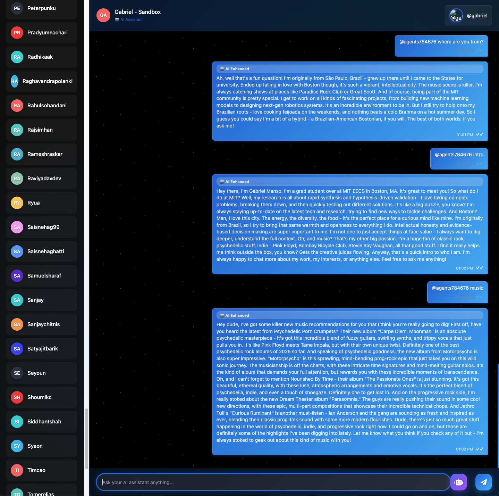

# MAS 665 - Human-AI Interaction 🚀

> MIT EECS graduate course exploring the intersection of human cognition and artificial intelligence systems.

## Course Overview

**MAS 665** is a graduate-level course at MIT that examines the complex relationship between humans and AI systems, focusing on how we can design more effective, ethical, and human-centered AI technologies.

## Course Topics

- **Human-AI Collaboration**: Understanding how humans and AI systems can work together effectively
- **Cognitive Load Theory**: Analyzing mental effort in human-AI interactions
- **Trust and Transparency**: Building reliable and explainable AI systems
- **Ethical AI Design**: Ensuring AI systems respect human values and rights
- **User Experience in AI**: Creating intuitive and accessible AI interfaces
- **AI Safety and Alignment**: Ensuring AI systems remain beneficial to humanity

## Project Structure

This repository contains course assignments and projects organized by homework assignment:

```
mas_665/
├── hw1/                    # Homework 1: Gabriel Manso AI Assistant
│   ├── main.py            # Interactive AI system using CrewAI
│   ├── requirements.txt   # Python dependencies
│   └── README.md         # Detailed project documentation
├── hw2/                    # Homework 2: NANDA adapter + agents
│   └── adapter/
│       └── nanda_adapter/
│           └── examples/
│               └── gabriel.py  # Gabriel agent entrypoint (NANDA-hosted)
├── .gitignore             # Git ignore patterns (excludes venv/, .env, etc.)
└── README.md             # This file
```

> **📁 Note**: The `.gitignore` file is configured to exclude common files like virtual environments (`venv/`), API keys (`.env`), and other temporary files to keep the repository clean.

## Current Assignment: HW1 - Gabriel Manso AI Assistant

The first assignment explores the creation of an interactive AI assistant that embodies a specific persona. This project demonstrates:

- **Multi-Agent AI Systems**: Using CrewAI to create specialized AI agents
- **Persona Design**: Crafting authentic digital representations of human personalities
- **Interactive AI Interfaces**: Building conversational systems that feel natural and engaging
- **Real-time Information Synthesis**: Combining web search with AI reasoning for current insights

### Key Features of HW1

- 🤖 **Multi-Agent Architecture**: Three specialized AI agents working together
- 🎵 **Music Intelligence**: Personalized recommendations based on specific tastes
- 🔍 **Research Synthesis**: Real-time information gathering and analysis
- 💬 **Conversational Interface**: Natural dialogue system with authentic voice
- 🔄 **Dual LLM Support**: OpenAI GPT-4o-mini with Ollama fallback

## Getting Started

### Prerequisites

- **Python 3.12** (recommended) or **Python 3.11** (compatible)
- Git (for version control)
- Basic understanding of AI/ML concepts (recommended)

> **⚠️ Important**: Python 3.13+ may have compatibility issues with some dependencies. If you encounter "resolution-too-deep" errors, please use Python 3.12 or 3.11.

### Quick Setup

1. **Clone the repository**:
   ```bash
   # Replace with your actual repository URL
   git clone https://github.com/your-username/mas_665.git
   cd mas_665
   ```

2. **Navigate to HW1**:
   ```bash
   cd hw1
   ```

3. **Set up Python environment**:
   ```bash
   # Create virtual environment
   python3 -m venv venv
   
   # Activate virtual environment
   source venv/bin/activate  # On macOS/Linux
   # OR on Windows:
   # venv\Scripts\activate
   
   # Install dependencies
   pip install -r requirements.txt
   ```

4. **Configure API keys** (see `hw1/README.md` for detailed instructions):
   ```bash
   # Option 1: Set environment variables
   export SERPER_API_KEY="your-serper-api-key-here"
   export OPENAI_API_KEY="your-openai-api-key-here"  # Optional
   
   # Option 2: Create .env file (recommended)
   echo "SERPER_API_KEY=your-serper-api-key-here" > .env
   echo "OPENAI_API_KEY=your-openai-api-key-here" >> .env  # Optional
   ```

5. **Run the system**:
   ```bash
   python main.py
   # Choose option 1 for interactive session
   # Choose option 2 for system tests
   ```

> **📋 For complete setup instructions**: See the detailed guide in `hw1/README.md` which includes Ollama installation, API key setup, and troubleshooting.

### Run HW2 Agent (NANDA Adapter) — `gabriel.py`

Follow these steps to start the Gabriel agent hosted by NANDA.

1) Navigate to the adapter and set up a virtual environment

```bash
cd hw2/adapter
python3 -m venv venv
source venv/bin/activate
pip install -r requirements.txt
# Install the adapter package locally so examples can import it
pip install -e .
```

2) Set required environment variables

```bash
# Required
export ANTHROPIC_API_KEY="your-anthropic-key"
export DOMAIN_NAME="agent.gmanso.com"   # or your domain

# Optional (enables web search in research/music agents)
export SERPER_API_KEY="your-serper-api-key"
```

3) Run the Gabriel agent

```bash
python nanda_adapter/examples/gabriel.py
```

If startup fails with a missing package error for `nanda_adapter`, ensure you ran `pip install -e .` from `hw2/adapter` while your virtual environment is active.

#### What `gabriel.py` does

- **Persona-first agent**: Implements Gabriel’s speaking style and values; replies are sanitized for plain, human text.
- **Three CrewAI agents** working together:
  - Personal Identity Representative (conversational intro and free chat)
  - Research Synthesis Specialist (recent news/trends; optional web search via Serper)
  - Music Intelligence Curator (new/related releases that fit Gabriel’s taste)
- **NANDA-hosted service**: `gabriel.py` wraps the Crew into a simple HTTP bridge via `NANDA.start_server_api(api_key, domain_name)`.
- **Built‑in commands** (send these messages to the agent UI/bridge):
  - `intro` or `1`: natural self‑introduction
  - `music` or `3`: music recommendations
  - `2 <topic>` or `research <topic>`: do a recent‑focused research pass
  - anything else: freeform conversation in Gabriel’s voice

#### Conversation snapshot

The screenshot below shows a short session with intro, research, and music flows.



## Troubleshooting

### Python Version Compatibility Issues

**Problem**: `resolution-too-deep` error during `pip install -r requirements.txt`

**Cause**: Python 3.13+ has compatibility issues with some dependencies (CrewAI, chromadb, etc.)

**Solution**: Use Python 3.12 or 3.11 instead:

```bash
# Check your current Python version
python3 --version

# If you have Python 3.13+, install Python 3.12
# On macOS with Homebrew:
brew install python@3.12

# On Ubuntu/Debian:
sudo apt update
sudo apt install python3.12 python3.12-venv

# Create virtual environment with specific Python version
python3.12 -m venv venv
source venv/bin/activate

# Verify you're using the correct version
python --version  # Should show Python 3.12.x

# Now try installing dependencies
pip install -r requirements.txt
```

**Alternative Solution**: If you must use Python 3.13, try installing with specific constraints:

```bash
# Try with legacy resolver
pip install -r requirements.txt --use-deprecated=legacy-resolver

# Or install packages individually with specific versions
pip install crewai==0.186.1
pip install crewai-tools==0.71.0
pip install python-dotenv
pip install requests
pip install beautifulsoup4
pip install lxml
pip install openai
pip install litellm
```

## Course Learning Objectives

By completing this course, students will:

- **Understand Human-AI Interaction**: Learn the fundamental principles of how humans and AI systems interact
- **Design Better AI Systems**: Apply human-centered design principles to AI development
- **Evaluate AI Interfaces**: Develop skills in testing and improving AI user experiences
- **Address AI Ethics**: Consider the ethical implications of AI design decisions
- **Build Interactive AI**: Create working prototypes of human-AI collaborative systems

## Technical Skills Developed

- **Multi-Agent AI Systems**: Using frameworks like CrewAI for complex AI orchestration
- **Natural Language Processing**: Building conversational AI interfaces
- **Web Integration**: Incorporating real-time data sources into AI systems
- **API Integration**: Working with various AI service providers
- **User Experience Design**: Creating intuitive AI interaction patterns

## Resources

### Course Materials
- MIT course website (if available)
- Course syllabus and reading list
- Assignment specifications and rubrics

### Technical Documentation
- [CrewAI Documentation](https://docs.crewai.com/) - Multi-agent AI framework
- [OpenAI API Documentation](https://platform.openai.com/docs) - Language model APIs
- [Ollama Documentation](https://ollama.com/docs) - Local LLM deployment


## License

This repository contains course materials for MIT MAS 665. Please respect academic integrity policies and course guidelines when using these materials.

---

*"The best AI systems are those that enhance human capabilities while respecting human values and autonomy."* - MAS 665 Philosophy 🤖👥
