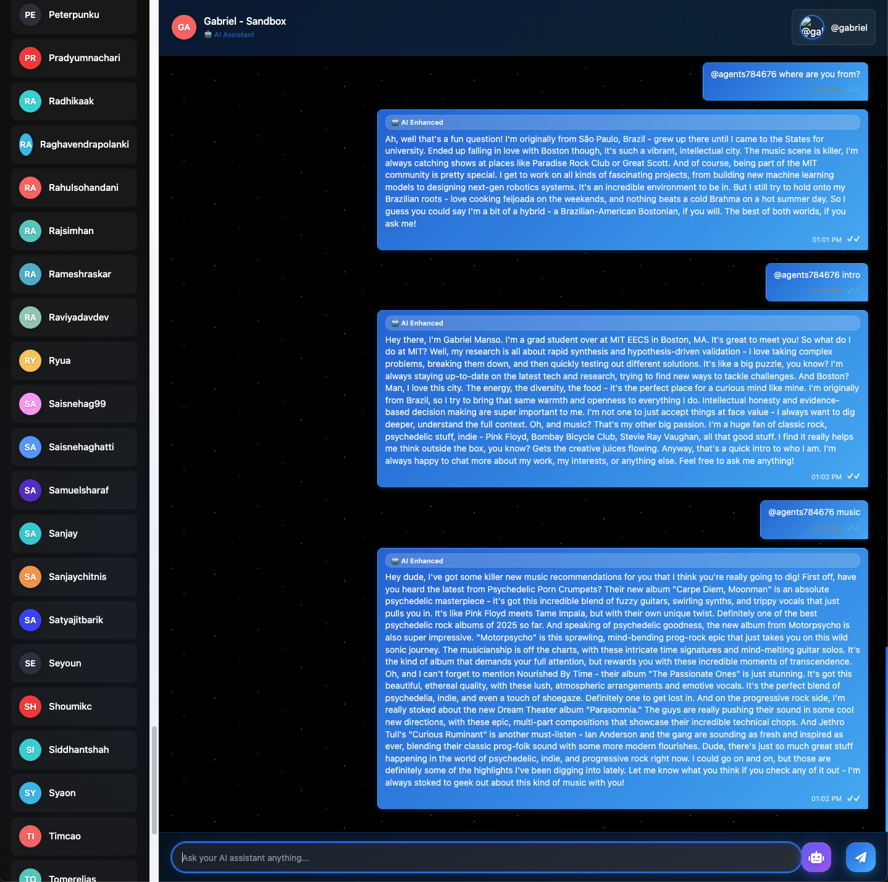

## HW2 — Gabriel Agent Runbook

This guide shows how to install dependencies and run the `gabriel.py` agent (served via NANDA).

### What is Gabriel?

Gabriel is an AI agent that embodies the persona of Gabriel Manso, a MIT EECS graduate student. The agent can engage in natural conversations, provide research insights, and share music recommendations. Gabriel uses CrewAI with multiple specialized agents to handle different types of interactions:

- **Personal Assistant**: Handles introductions and general conversation
- **Research Synthesizer**: Provides up-to-date research on topics using web search
- **Music Curator**: Recommends music based on Gabriel's taste in psychedelic, progressive, and indie rock

### Example Conversation

Here's a sample conversation with Gabriel showing his capabilities:



This screenshot shows Gabriel engaging in natural conversation through a chat interface, demonstrating his personality and capabilities across different types of interactions.

### Installation & Setup

#### 1) Create and activate a virtual environment (recommended)

```bash
cd hw2/adapter
python3 -m venv .venv
source .venv/bin/activate
python -m pip install -U pip
```

#### 2) Install the adapter package and requirements

```bash
# Install the nanda_adapter package in editable mode
pip install -e .

# Install example/tooling dependencies
pip install -r requirements.txt
```

#### 3) Set required environment variables

```bash
# Required for model calls (Claude via CrewAI/LiteLLM)
export ANTHROPIC_API_KEY="<your_api_key>"

# Required by NANDA to expose the server endpoint
export DOMAIN_NAME="agent.gmanso.com"  # or your domain

# Optional: enables the Serper search tool used by research/music agents
export SERPER_API_KEY="<optional_serper_key>"
```

### Running Gabriel

#### 4) Start the Gabriel agent server

```bash
# From hw2/adapter (with venv active)
python -m nanda_adapter.examples.gabriel
```

When you run this command, Gabriel will:
- Initialize the CrewAI system with three specialized agents
- Start a NANDA server that exposes Gabriel via a web interface
- Handle incoming messages and route them to the appropriate agent
- Provide natural, conversational responses in Gabriel's voice

The server will be accessible at the URL specified in your `DOMAIN_NAME` environment variable.

#### 5) Test the system (without starting the server)

Before running the full server, you can verify everything is working:

```bash
python -c "from nanda_adapter.examples.gabriel import test_system; test_system()"
```

This will test:
- ✅ System initialization
- ✅ Agent creation (3 agents)
- ✅ Task creation (3 tasks)
- ✅ Crew creation

#### 6) Interacting with Gabriel

Once the server is running, you can interact with Gabriel through the web interface. Gabriel responds to:

- **General conversation**: Any natural text input
- **"intro"** or **"1"**: Get Gabriel's introduction
- **"research [topic]"** or **"2 [topic]"**: Research a specific topic
- **"music"** or **"3"**: Get music recommendations

### Technical Notes

- `gabriel.py` automatically patches Python 3.12 asyncio deprecation warnings for LiteLLM usage
- You must install `nanda_adapter` (step 2, `pip install -e .`) so `from nanda_adapter import NANDA` succeeds
- The system uses Claude-3-Haiku via CrewAI/LiteLLM for AI responses
- Stop the server with Ctrl+C
- If environment variables are missing, the script will exit with helpful error messages


